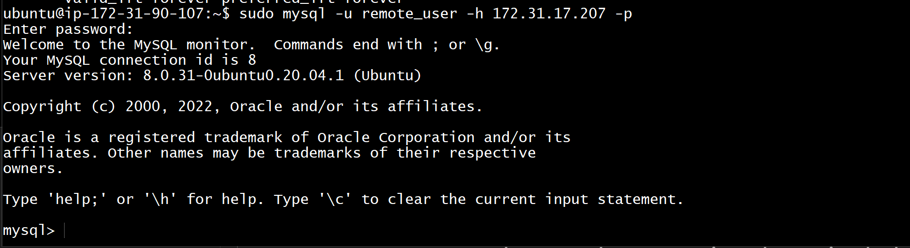

# STEP GUIDE To IMPLEMENT A CLIENT SERVER ARCHITECTURE USING MYSQL DATABASE MANAGEMENT SYSTEM (DBMS).

## Install mysql server and client by using the following process below

## update/upgrade package repository on the sql server and client using the commands below

`sudo apt update`

`sudo apt upgrade`

## install MySQL server on the ser using the script below on the mysql server ubuntu machine, when asked if you want to continue with installation press Y

`sudo apt install mysql-server`

## check if mysql was installed correctly by running the script below

`mysql --version`

## setup a password for connection using the script below. these comes pre installed with mysql server

`ALTER USER 'root'@'localhost' IDENTIFIED WITH mysql_native_password BY 'PassWord.1';`

## create a database and setup necessary priveleledges for the user

## install the mysql client using the script below on the mysql client ubuntu machine

`sudo apt install mysql-client`

## Ensure to update inbound rules for mysql server for port 3306 from AWS portal

## configure MySQL server to allow connections from remote hosts by updating the loopback ip 127.0.0.1 to 0.0.0.0 from the text file to be accessed using the code below

`sudo vi /etc/mysql/mysql.conf.d/mysqld.cnf`

## the mysql service by updating the changes made to the config file by running the script below

`sudo systemctl restart mysql`

## try to connect to the mysql server using the script below

` sudo mysql -u remote_user -h <hostIp> -p`

## you should try to see if you get a response when trying to show Database from the cleint server

`Show databases;`

